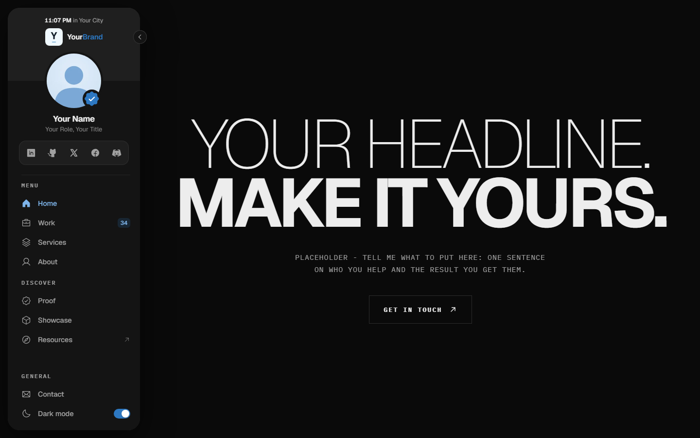
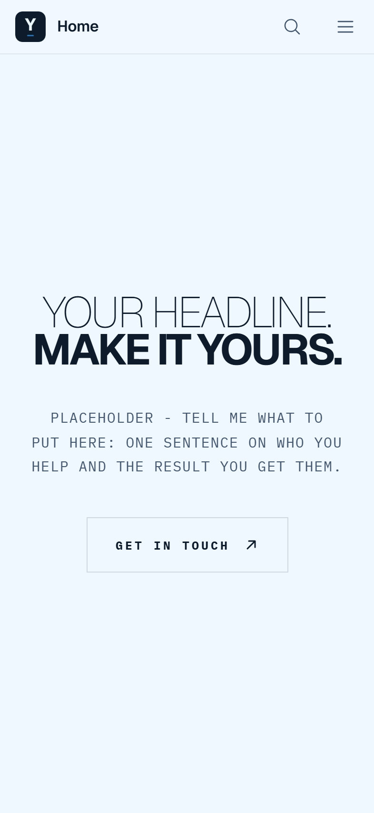
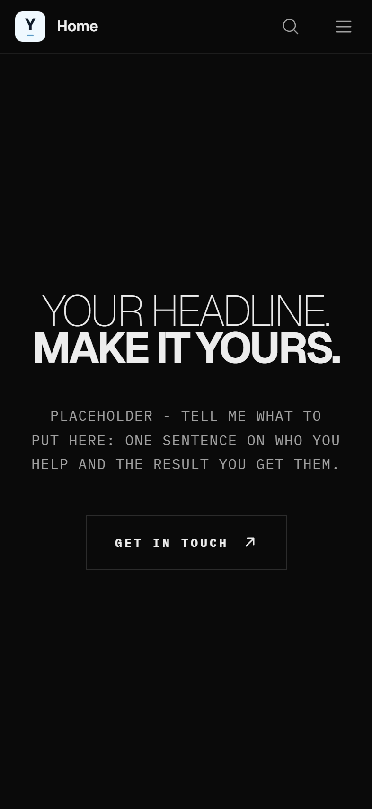

# Portfolio Template V2

A personal portfolio with a floating sidebar that folds into an icon rail, a "signal flow" line background, and one long Home page built from scroll scenes: a reading-band manifesto, a live flow diagram that builds as you scroll, a bento of work chapters that open as sheets with their own URLs, a stacked services deck, an About floor, a proof ledger, a product showcase with a film and walk-through rooms, and a contact plate. Separate phone layout with a top bar and a swipe-to-close drawer. Light and dark themes.

Every piece of content is a placeholder. You swap in your own.

Stack: Vite 8, React 19, TypeScript (strict), React Router 8, Tailwind CSS v4 + CSS custom properties, GSAP + ScrollTrigger, Lenis, three.js, Phosphor icons, Geist + IBM Plex Mono (self-hosted).

## What it looks like

Straight from this repo, placeholders and all.

**Desktop** - the floating sidebar and the Home hero.



**Phone** - top bar, drawer navigation, the same sections stacked. Light and dark.

<p>
  
  &nbsp;&nbsp;
  
</p>

## Run it

Needs Node 20.19+ (or 22.12+).

```bash
npm install
npm run dev        # http://localhost:5190
npm run build      # typecheck + production build to dist/ (also writes sitemap.xml, llms.txt, version.json)
npm run preview    # serve the build on http://localhost:5191
npm run lint       # ESLint with the TypeScript parser and the React hooks rules
```

## Make it yours

Every spot that needs your content says **PLACEHOLDER** and describes what goes there. Edit the files yourself, or open the repo in an AI coding tool and tell it what to put in each spot. All copy lives in `src/content/` as typed data, so you never have to touch a component to change words.

| What | Where |
|---|---|
| Name, brand, role, email, location, clock time zone, photo, logo, credential, socials, off-site links | `src/content/site.ts` (start here) |
| Search-result title and description, link preview | the Home entry in `src/app/routes.ts`, and the head of `index.html` (for crawlers that do not run JavaScript) |
| Home headline, manifesto statement, section titles, Work chapters | `src/content/home.ts` |
| The builds inside each Work chapter (sites, funnel pages, apps, side projects) | `src/content/work.ts` |
| The flow diagram (stages, links, the lines under each stage) | `src/content/automation.ts` |
| Services, method, About, tool logos | `src/content/services.ts`, `method.ts`, `about.ts`, `tools.ts` |
| Proof (client accounts, video clips, quotes) | `src/content/proof.ts` + videos in `public/media/` |
| Showcase (one product: film, stats, rooms, FAQ) | `src/content/showcase.ts` + `public/media/showcase-film.mp4` |
| Contact page, FAQs, Privacy and Terms | `src/content/contact.ts`, `faqs.ts`, `legal.ts` |
| Pictures | `public/images/` - replace a file with yours at the same size, or point the content entry at a new file |
| Demo pages people can open live | `public/demos/` (`sites/`, `funnels/`, `plans/`), linked from `work.ts` |
| Pages and the sidebar menu | `src/app/routes.ts` (one entry per page) |
| Order of the Home sections | `src/features/home/sections.ts` (one line per section) |
| Colors, shadows, motion | `src/styles/tokens.css` (one accent color, light and dark) |
| Share image | `public/og-image.png` - re-render it from your own hero with `node scripts/make-og-image.mjs` while `npm run dev` runs |
| Favicon | `public/favicon.png`, `public/apple-touch-icon.png` |

Then set your domain in `site.url` and in the `og:` tags of `index.html`. The sitemap, `robots.txt` and `llms.txt` are written from it at build time.

### Your own pictures

Pictures are served with a year-long cache in the nginx example, so give a changed picture a new file name. Where a picture has smaller copies for phones (a `srcSet` in the content), make them with:

```bash
node scripts/make-image-variants.mjs public/images/covers/my-site.webp 480,640,960
```

That writes `public/images/covers/480/my-site.webp` and the others next to it, the layout the content files expect.

### The placeholders

Every placeholder picture, video and demo page comes from `npm run placeholders` (`scripts/make-placeholders.mjs`), driven by the lists in `scripts/placeholders/*.json`. You never need it once your own files are in, but it shows the exact size every slot expects.

## Checks

Each part of the site has an end-to-end check that drives it in a real browser (Playwright) and prints PASS / FAIL lines. Start `npm run dev`, then run any of them:

```bash
npx playwright install chromium   # once
npm run check:sidebar             # also check:home, check:manifesto, check:automation, check:work-sheet,
                                  # check:services, check:about, check:showcase, check:proof, check:contact, check:background
```

They read `BASE` (default `http://localhost:5190`). Screenshots land in `scripts/out/`. On the production build: `npm run build && npm run preview`, then `BASE=http://localhost:5191 node scripts/audit/responsive.mjs` (11 widths, no sideways scroll) and `node scripts/audit/csp-harness.mjs` (every route under the production Content-Security-Policy).

## Deploy

It is a static single-page app: `npm run build` and serve `dist/` with every unknown path falling back to `index.html`.

`deploy/` holds an nginx example with strict security headers: `nginx.conf` (the site), `headers.conf` (CSP, HSTS and friends for the app) and `demos-headers.conf` (looser rules for the standalone demo pages). The CSP allows the one inline theme script in `index.html` by its hash. If you edit that script, run `npm run csp:check` and put the hash it prints into `deploy/headers.conf`.

## Notes

- **Headline size.** The Home hero sizes its bold line in container units so it fills the column at any width. The number is measured on the current words. When you change the headline, follow the comment on `.hero__title` in `src/features/home/hero/hero.css` to re-measure.
- **Motion.** Desktop (1024px+, a mouse, motion allowed) gets Lenis smooth scrolling and GSAP scroll scenes; phones keep native scroll and use CSS scroll timelines. Everything has a reduced-motion version. Pinned sections use CSS `position: sticky`, never ScrollTrigger pins.
- **Background.** three.js loads after the first interaction (or a few seconds after load), as its own chunk, so it never slows the first paint. Never put a `backdrop-filter` over it: blur over an animated canvas is the most expensive thing a page can do.
- **Work chapters** open as sheets with their own URLs (`/work/<chapter>`), their own title and description, and structured data. Add a chapter in `home.ts` and the bento, the sheet, the sitemap and `llms.txt` follow. The bento layout is keyed by chapter id in `src/features/home/work/work.css` (`grid-template-areas`).
- **Contact form** opens the visitor's own email app with the message filled in (`src/lib/mail.ts`). Nothing is sent or stored by the site. To post to a backend instead, replace the hand-off in `ContactForm.tsx`.
- **Theme.** Dark by default; a visitor's light pick is applied before first paint by the small script in `index.html`.

## Credits

- Icons: [Phosphor](https://phosphoricons.com) (MIT).
- Fonts: [Geist](https://github.com/vercel/geist-font) and [IBM Plex Mono](https://github.com/IBM/plex), both SIL Open Font License 1.1 (license texts in `public/fonts/`).
- Motion: [GSAP](https://gsap.com) and [Lenis](https://lenis.dev). Background: [three.js](https://threejs.org).

## License

[PolyForm Noncommercial 1.0.0](LICENSE), plus one extra permission: you can use it for **your own** portfolio, even if that portfolio promotes your paid services.

What it does not allow without a commercial license: selling or reselling this template, or building portfolio sites for other people for payment. For a commercial license, email brewedops@gmail.com.
